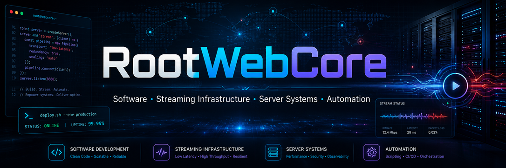

  

# RootWebCore

### Software, streaming infrastructure, server systems and automation tools.

  

  

  
  
  
  

---

## ⚡ About RootWebCore

<table>
<tr>
<td align="center" width="25%">
  <h3>💻 Software</h3>
  
Clean, scalable and maintainable application development.

</td>
<td align="center" width="25%">
  <h3>📡 Streaming</h3>
  
Live streaming systems, HLS workflows and media infrastructure.

</td>
<td align="center" width="25%">
  <h3>🖥️ Servers</h3>
  
Linux servers, hosting environments, performance and security.

</td>
<td align="center" width="25%">
  <h3>🤖 Automation</h3>
  
Deployment flows, scripts, cron systems and backend automation.

</td>
</tr>
</table>

---

## 🧰 Tech Stack

  
  
  
  

  
  
  
  

  
  
  
  

---

## 📊 Crypto Prices

  
  
  
  

---

## 📈 GitHub Stats

  

  

---

## 🚀 Focus Areas

<table>
<tr>
<td align="center">
  <b>Low-latency streaming</b> 
  HLS, media workflows, stream stability
</td>
<td align="center">
  <b>Backend systems</b> 
  PHP, Laravel, APIs, admin panels
</td>
</tr>
<tr>
<td align="center">
  <b>Server operations</b> 
  Linux, Nginx, Apache, Cloudflare
</td>
<td align="center">
  <b>Automation</b> 
  Cron jobs, deployment scripts, monitoring flows
</td>
</tr>
</table>

---

### Code. Servers. Streaming. Automation.

 

